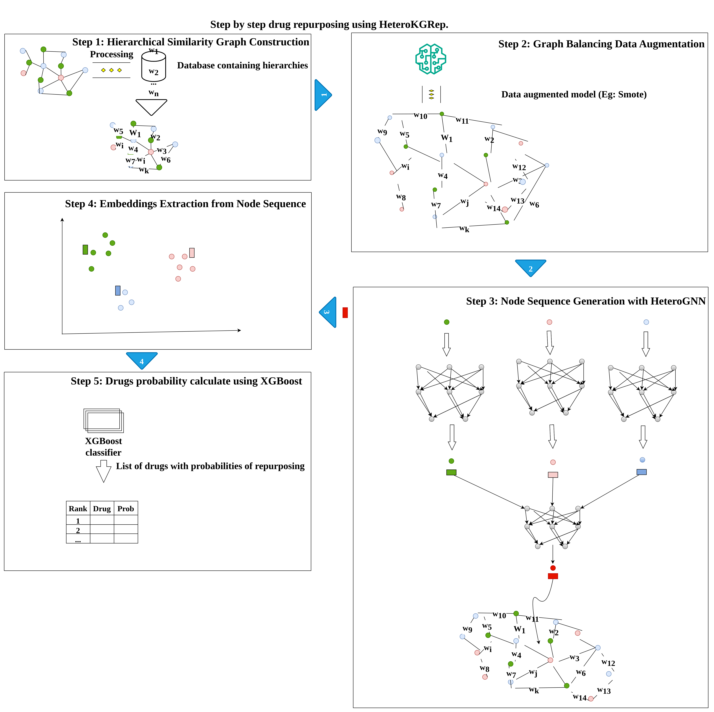

# HeteroKGRep
The official code implementation for HeteroKGRep from our paper:
"Heterogeneous Knowledge Graph based Drug Repositioning" (Knowledge-Based Systems, 2024).

## Model description

HeteroKGRep is a drug repositioning framework that leverages heterogeneous biomedical knowledge graphs to discover novel drug–disease associations.
Unlike existing methods based on homogeneous data sources, HeteroKGRep integrates multimodal biomedical information (ontologies, pathways, literature, genetic data) to enrich representation learning and improve prediction accuracy.

## Pipeline Overview

#### Step 1 — SMOTE-based Graph Augmentation

Handles entity distribution imbalance in the heterogeneous knowledge graph.

Generates synthetic nodes and edges while preserving the graph structure.

#### Step 2 — Node Sequence Generation

Performs random walks to capture local and global structural context.

Learns entity embeddings from augmented graph structure.

#### Step 3 — HeteroGNN Representation Learning

Uses type-specific MLP modules for drugs, diseases, and other biomedical entities.

Extracts embeddings capturing semantic and structural relationships.

#### Step 4 — Association Prediction with XGBoost

Trains an XGBoost classifier on learned embeddings to predict novel drug–disease associations.

## Model Architecture

## Setup
Clone the repository and navigate to the project directory:
git clone https://github.com/CESKOUTSE/HeteroKGRep.git
cd HeteroKGRep

#### Requirements:

Python 3.8+

PyTorch >= 1.10

DGL (Deep Graph Library)

scikit-learn

imbalanced-learn (for SMOTE)

XGBoost

## Files

HeteroKGRep.ipynb → Main model training and evaluation

graph_augmentation.py → SMOTE-based graph augmentation

node_sequence.py → Random walk sequence generation

hetero_gnn.py → Heterogeneous GNN model

predict_xgboost.py → Association prediction

data/ → Biomedical knowledge graph data and processed embeddings

## Dataset

The knowledge graph integrates multiple biomedical data sources:

Ontologies (e.g., DrugBank, DO)

Biological pathways

Literature-based associations

Genetic and molecular interaction data
